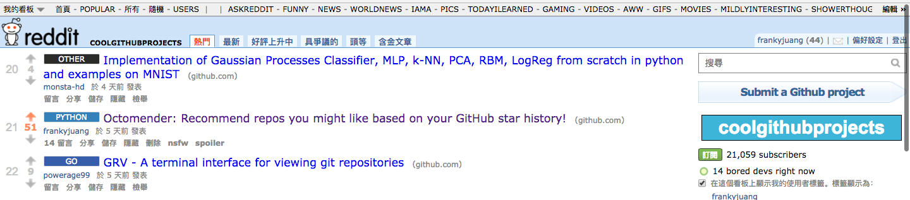

# Octomender
Github Repo Recommender System.
```
Octomender = Octocat + Recommender
```
Get repo recommendation based on your GitHub star history.

## <a href="https://octomend.com">~~[HELP] Algorithm Testing~~</a> End of Service
~~The recommendation algorithm is deployed and being tested on [octomend.com](https://octomend.com).~~

~~Visit [octomend.com](https://octomend.com) to help improve the recommendation.~~

__End of Service since GitHub published ["Discover Repositories"](https://github.com/dashboard/discover) service.__


## Dependencies
- [redis](https://redis.io/): An in-memory database that persists on disk

### Core
- [hireids](https://github.com/redis/hiredis): Minimalistic C client for Redis >= 1.2
- [OpenMP>=4.0](http://www.openmp.org/): C/C++ API that supports multi-platform shared memory multiprocessing programming

### Preprocessing
- [redis-py](https://github.com/andymccurdy/redis-py): Redis Python Client

### Website
- [Flask](http://flask.pocoo.org): A microframework for Python based on Werkzeug, Jinja 2 and good intentions
- [GitHub-Flask](https://github.com/cenkalti/github-flask): Flask extension for authenticating users with GitHub and making requests to the API
- [gunicorn](http://gunicorn.org): A Python WSGI HTTP Server for UNIX
- [google-cloud-datestore](https://github.com/GoogleCloudPlatform/google-cloud-datastore): Low-level Java and Python client libraries for Google Cloud Datastore

## Dataset
[Github Archive](https://www.githubarchive.org/)

## Build Core
```
cd core; make
```

## Preprocessing
### [parse.py](preprocessing/parse.py)
Parse raw json data files into three pickle data files.
- output-data-basename.user: map of user id (str) to user name (str)
- output-data-basename.repo: map of repo id (int) to repo name (str)
- output-data-basename.edge: list of tuples of user-repo edge (str, int)
```
Usage: parse.py {-m|--member|-w|--watch} {<input-json-directory>|<input-json-file>} <output-data-basename>
  -m, --member      parse MemberEvent.
  -w, --watch       parse WatchEvent.
Ex:    parse.py -m 2017-06-01-0.json data
Ex:    parse.py --watch json/2017-05/ data/2017-05
```
Refer raw json data format to [GitHub API v3](https://developer.github.com/v3/activity/events/types/).

### [parse_mp.py](preprocessing/parse_mp.py)
Ditto, but run with multiprocessing. Default number of processes is 16.
```
Usage: parse_mp.py {-m|--member|-w|--watch} {<input-json-directory>|<input-json-file>} <output-data-basename> [n-process]
  -m, --member      parse MemberEvent.
  -w, --watch       parse WatchEvent.
  n-process         number of processes when multiprocessing.
Ex:    parse.py -m 2017-06-01-0.json data
Ex:    parse.py --watch json/2017-05/ data/2017-05 32
```

### [mergedata.py](preprocessing/mergedata.py)
Merge multiple pickle data files into one.
```
Usage: mergedata.py <input-data-dir> <output-data-basename>
Ex:    mergedata.py data/2016-010203/ data/2016-Q1
```

### [graph2redis.py](preprocessing/graph2redis.py)
Insert graph data into redis database.
```
Usage: graph2redis.py <input-edgelist> <redis-port>
Ex:    graph2redis.py data/2016-Q1.edge 6379
```

## Thanks

[importpython](https://importpython.com/newsletter/) and reddit.




## License
MIT
